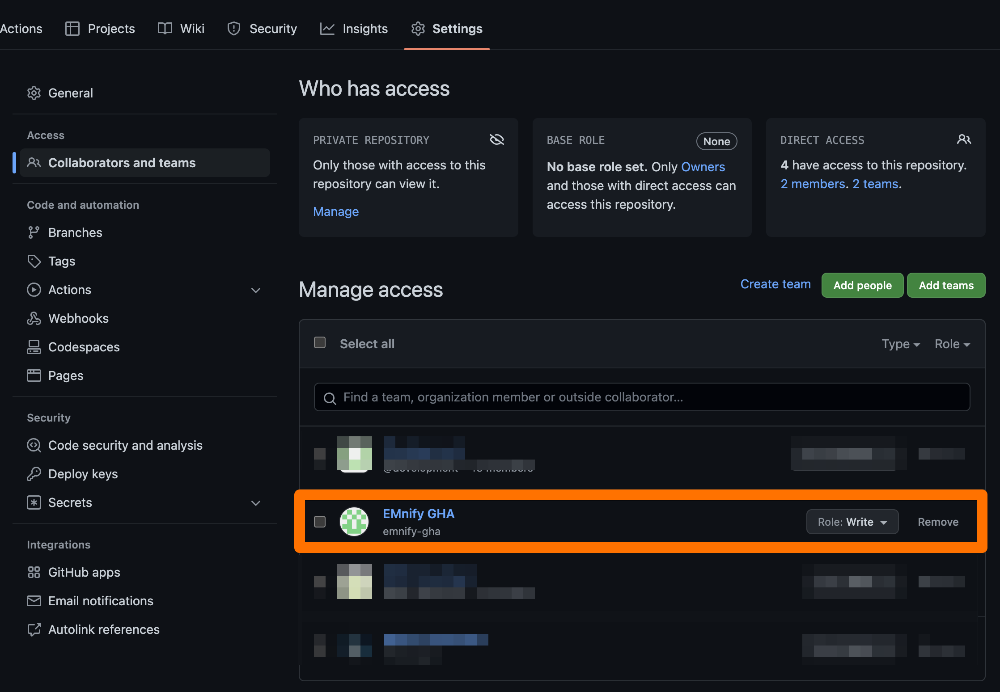
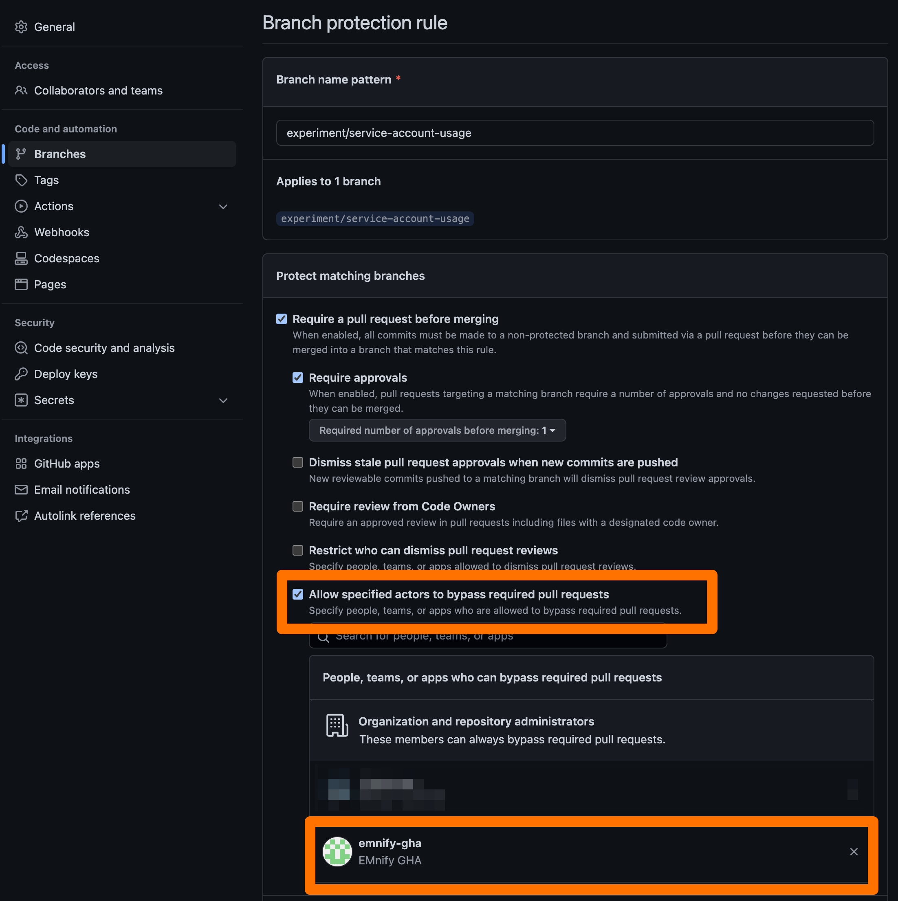

# EMnify Service Account

This account is made to provide your GitHub actions with some privileged permissions.

## How to use it

Let's assume I have a workflow for version bump or release
and save changelog when something is published to a protected branch.

### Define your workflow

Follow this example to design your workflow right.
```yaml
# .github/workflows/bump.yml

name: Example Service Account Usage
on:
  push:
    branches:
      - experiment/service-account-usage

jobs:
  run:
    name: Commit To Protected Branch Using Service Account
    runs-on: ubuntu-latest
    # Prevent circular workflow run
    if: "!contains(github.event.pusher.name, 'emnify-gha')"
    steps:
      - name: Cancel Previous Runs
        uses: styfle/cancel-workflow-action@0.9.1
        with:
          access_token: ${{ github.token }}

      - uses: actions/checkout@v3
        name: Checkout Branch Using Service Account!
        with:
          # It's important to use the service account token here,
          # not the personal access token or default token.
          token: ${{ secrets.EMNIFY_GITHUB_ACTIONS_TOKEN }}

      - name: Make Required Changes
        run: echo "${{ github.event.head_commit.timestamp }}" > change.txt

      - name: Commit Changes
        uses: stefanzweifel/git-auto-commit-action@v4
        with:
          commit_message: '[Automated] Commit To Protected Branch Using Service Account'
```

### Confugure Repository

Add write access to the service account account to the repository.



Configure branch protection to prevent unauthorized pushes to the protected branch. And add the service account to the exceptions.



## You're all set!
